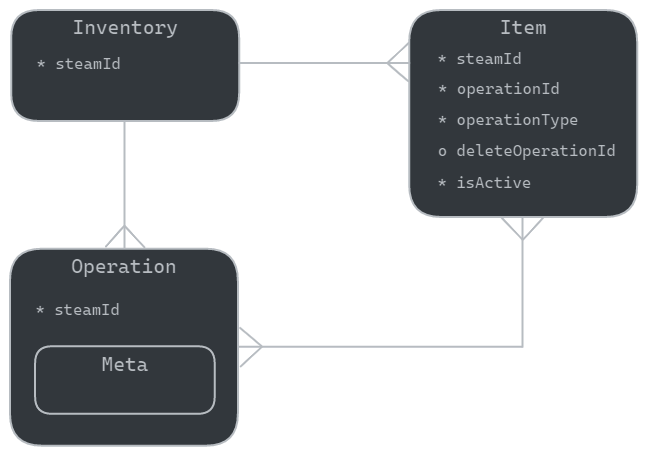

# Dota Showcase - Inventory Service

REST API service to store and track changes of steam user's dota 2 inventory items.

## Features

* Inventory history - created, updated, deleted items
* Rate limiter
* Unit tests

## API Docs

Swagger OpenAPI 3 is available by path:

* UI:   `host:port/swagger-ui.html`
* JSON: `host:port/api-docs`

### Inventory Endpoints

* Show Inventories: `GET /api/v1/inventories/`
* Create an Inventory (load items from steam): `POST /api/v1/inventories/:steamid/`
* Show an Inventory: `GET /api/v1/inventories/:steamid/`
* Update an Inventory (reload items from steam): `PUT /api/v1/inventories/:steamid/`
* Delete an Inventory: `DELETE /api/v1/inventories/:steamid/`

### Inventory Items Endpoints

* Show Inventory Items: `GET /api/v1/inventories/:steamid/items/`
* Show Inventory Items (pagination): `GET /api/v1/inventories/:steamid/items/page/`
* Show Inventory Items changes: `GET /api/v1/inventories/:steamid/changes/`
* Show Inventory Items changes (for a version): `GET /api/v1/inventories/:steamid/changes/:version/`

## Getting Started

### Prerequisites

* Java 21
* Apache Maven
* MongoDB 8.0

### Installation

1. Create `.env` based on `.env.example`
2. Create `environment.properties` based on `environment.properties.example` in `app/src/main/resources`
3. Set the steam api key property to access Steam's API:
    ```bash
    env.steam.api.key=your_api_key
    ```
4. To run in development environment. 
   You can use a default build for IntelliJ IDEA to run the app - `.run/dev-build.run.xml`.
    ```bash
    docker-compose up
    ```
5. To run in production environment
    ```bash
    docker compose -f docker-compose.prod.yml up -d
    ```

## Data Model

Conceptual entity relation diagram (Barker's system):



## Back-of-the-envelope Estimations

###  Storage Space

Assumptions:

* Average inventory item size - 500 bytes.
* Average user has 7000 inventory items.
* Users update inventory once per day. Each day it increased by some small coefficient (0.05).
* Data is stored for a year.

Estimate:

* User inventory size: 500 * 7000 = 3.5 MB
* User inventory size for a year: 3.5 MB + (365 * 0.05 * 3.5) = ~70 MB
* **Storage for 100K users: 70MB * 1000000 = 7 GB**

## Resources

- [Steam API - GetPlayerItems](https://wiki.teamfortress.com/wiki/WebAPI/GetPlayerItems)

## Issues

### Run tests on linux - problem with flapdoodle embedded mongo db
Download & install libssl1.1 latest version:

```bash
wget http://nz2.archive.ubuntu.com/ubuntu/pool/main/o/openssl/libssl1.1_1.1.1f-1ubuntu2_amd64.deb
sudo dpkg -i libssl1.1_1.1.1f-1ubuntu2_amd64.deb
 ```

## License

The GNU General Public License v3.0. Please see [License File](LICENSE) for more information.